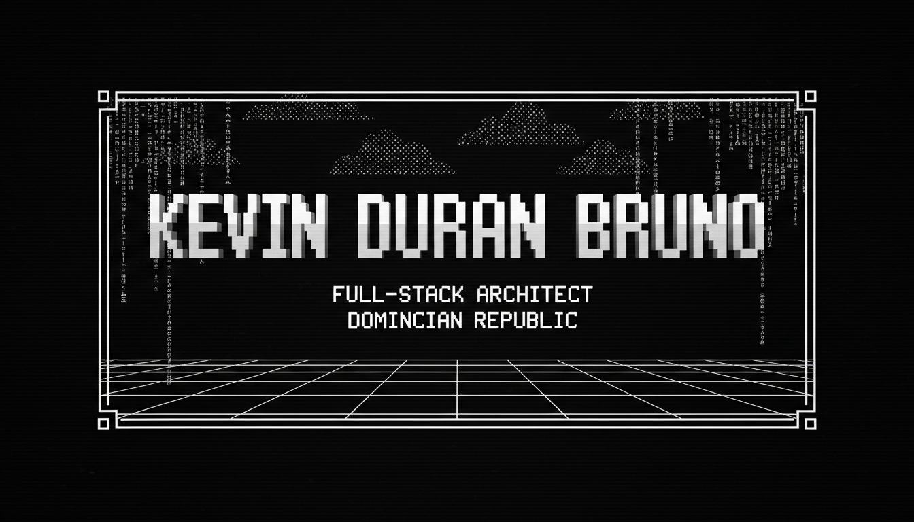

<!-- ═══════════════════════════════════════════════════════════════
     KEVIN DURAN BRUNO — ASCII RENAISSANCE RETROWAVE README
     ═══════════════════════════════════════════════════════════════ -->

<!-- HEADER IMAGE: Monochrome ASCII Retrowave -->

  

<!-- ANIMATED TYPING: Boot Sequence -->

 

<!-- ANIMATED ASCII DIVIDER -->

---

<!-- ANIMATED TYPING: Identity Card -->

  

<!-- ANIMATED STATUS BARS -->
<pre>
┌──────────────────────────────────────────────────────────┐
│  XP    ████████████████████████████████████████░░░░  72% │
│  HP    ██████████████████████████████████████████  MAX  │
│  MP    ██████████████████████████████████████░░░░░  85% │
│  CAFF  ██████████████████████████████████████████  ∞   │
└──────────────────────────────────────────────────────────┘
</pre>

---

<!-- ═══════════════════════════════════════════════════════════════
     LA CREAZIONE DIGITALE — The Creation of the Architect
     ═══════════════════════════════════════════════════════════════ -->

<!-- ANIMATED TYPING: Section Title -->

 

<!-- CREATION IMAGE: ASCII Art Michelangelo -->

  

<pre>
╔═══════════════════════════════════════════════════════════════════════════╗
║                                                                           ║
║   "AND THE DIVINE SPARK OF CREATION REACHED THE ARCHITECT..."            ║
║                                                                           ║
║   THE GAP  —  THE DIGITAL ETHER  —  THE CONNECTION                        ║
║                                                                           ║
║   [ DIVINE REALM: Cloud · Architecture · AI ]  ←——✦——→  [ HUMAN REALM ] ║
║                                                                           ║
╚═══════════════════════════════════════════════════════════════════════════╝
</pre>

---

<!-- ═══════════════════════════════════════════════════════════════
     ANIMATED ASCII GLOBE — Rotating Earth
     ═══════════════════════════════════════════════════════════════ -->

<!-- ANIMATED TYPING: Globe Title -->

  

<!-- ANIMATED ASCII GLOBE -->
<pre>
╔═══════════════════════════════════════════════════════════════════════════╗
║                                                                           ║
║                      ████████                                             ║
║                  ██████░░░░██████                                         ║
║                ████░░░░░░░░░░░░████                                       ║
║              ████░░░░░░████░░░░░░████                                     ║
║            ████░░░░░░████████░░░░░░████                                   ║
║          ████░░░░░░████████████░░░░░░████                                 ║
║          ████░░░░████████████████░░░░████                                 ║
║        ████░░░░░░████████████████░░░░░░████                               ║
║        ████░░░░░░██████████████████░░░░████                               ║
║        ████░░░░░░██████████████████░░░░████                               ║
║        ████░░░░░░░░██████████████░░░░░░████                               ║
║          ████░░░░░░░░██████████░░░░░░████                                 ║
║          ████░░░░░░░░░░██████░░░░░░░░████                                 ║
║            ████░░░░░░░░░░██░░░░░░░░████                                   ║
║              ████░░░░░░░░░░░░░░░░████                                     ║
║                ████░░░░░░░░░░░░████                                       ║
║                  ██████░░░░██████                                         ║
║                      ████████                                             ║
║                                                                           ║
║              ☩  KEVIN DURAN BRUNO  ☩                                      ║
║         "The Architect is the measure of all systems"                     ║
║                                                                           ║
╚═══════════════════════════════════════════════════════════════════════════╝
</pre>

  

<pre>
┌──────────────────────────────────────────────────────────┐
│  NAME   : Kevin Duran Bruno                              │
│  ORIGIN : Dominican Republic 🇩🇴                         │
│  CLASS  : Full-Stack Architect                           │
│  ALIGN  : Chaotic Builder                                │
│  FOCUS  : Backend · Cloud · AI · Distributed Systems     │
│  STATUS : Currently architecting digital cathedrals      │
└──────────────────────────────────────────────────────────┘
</pre>

---

<!-- ═══════════════════════════════════════════════════════════════
     STATUE OF DAVID — Skill Matrix
     ═══════════════════════════════════════════════════════════════ -->

<!-- ANIMATED TYPING: Skills Title -->

  

<pre>
▓▓▓▓▓▓▓▓▓▓▓▓▓▓▓▓▓▓▓▓▓▓▓▓▓▓▓▓▓▓▓▓▓▓▓▓▓▓▓▓▓▓▓▓▓▓▓▓▓▓▓▓▓▓▓▓▓▓▓▓▓▓▓▓▓▓▓▓▓▓▓▓▓▓▓▓▓▓▓▓▓▓▓▓▓▓▓▓▓▓▓▓▓
▓▓▓                                                                                  ▓▓▓
▓▓▓   ┌─────────────────────────────────────────────────────────────────────────┐     ▓▓▓
▓▓▓   │  SYSTEM ARCHITECTURE   ███████████████████████████████████░░░░░  95%   │     ▓▓▓
▓▓▓   │  BACKEND ENGINEERING   █████████████████████████████████░░░░░░  92%   │     ▓▓▓
▓▓▓   │  PROBLEM SOLVING       █████████████████████████████████████░░  96%   │     ▓▓▓
▓▓▓   │  DATABASE DESIGN       ████████████████████████████████░░░░░░  85%   │     ▓▓▓
▓▓▓   │  CLOUD & DEVOPS        ███████████████████████████░░░░░░░░░░░  78%   │     ▓▓▓
▓▓▓   │  FRONTEND CRAFT        ████████████████████████░░░░░░░░░░░░░░  72%   │     ▓▓▓
▓▓▓   │  MOBILE DEVELOPMENT    ████████████████████████░░░░░░░░░░░░░░  70%   │     ▓▓▓
▓▓▓   └─────────────────────────────────────────────────────────────────────────┘     ▓▓▓
▓▓▓                                                                                  ▓▓▓
▓▓▓   "Every block of stone has a statue inside it" — Michelangelo                  ▓▓▓
▓▓▓   "Every codebase has an architecture inside it" — Kevin Duran Bruno             ▓▓▓
▓▓▓                                                                                  ▓▓▓
▓▓▓▓▓▓▓▓▓▓▓▓▓▓▓▓▓▓▓▓▓▓▓▓▓▓▓▓▓▓▓▓▓▓▓▓▓▓▓▓▓▓▓▓▓▓▓▓▓▓▓▓▓▓▓▓▓▓▓▓▓▓▓▓▓▓▓▓▓▓▓▓▓▓▓▓▓▓▓▓▓▓▓▓▓▓▓▓▓▓▓▓
</pre>

---

<!-- ANIMATED TYPING: Cathedral Title -->

  

<pre>
╔══════════════════════════════════════════════════════════════════════════════════════════╗
║                    ☩  A R S E N A L  ☩  T E C H N O L O G I E S  ☩                    ║
╠══════════════════════════════════════════════════════════════════════════════════════════╣
║                                                                                         ║
║   ┌─────────────────────┐  ┌─────────────────────┐  ┌─────────────────────┐            ║
║   │  ⚔️ HIGH TONGUES   │  │  🛡️ DIVINE ARMOR   │  │  ☁️ AETHER INFRA   │            ║
║   ├─────────────────────┤  ├─────────────────────┤  ├─────────────────────┤            ║
║   │  ■ C# / .NET        │  │  ■ ASP.NET Core     │  │  ■ Azure            │            ║
║   │  ■ Kotlin           │  │  ■ Blazor           │  │  ■ Google Cloud     │            ║
║   │  ■ Go               │  │  ■ Jetpack Compose  │  │  ■ Docker           │            ║
║   │  ■ Python           │  │  ■ React            │  │  ■ Kubernetes       │            ║
║   │  ■ Java             │  │  ■ Tailwind CSS     │  │  ■ Linux            │            ║
║   │                      │  │                      │  │  ■ Git / CI·CD      │            ║
║   └─────────────────────┘  └─────────────────────┘  └─────────────────────┘            ║
║                                                                                         ║
║   ┌─────────────────────┐  ┌──────────────────────────────────────────────────┐            ║
║   │  🗄️ RELICS OF DATA │  │  📜 SCROLLS OF WISDOM                          │            ║
║   ├─────────────────────┤  ├──────────────────────────────────────────────────┤            ║
║   │  ■ PostgreSQL       │  │  ■ Distributed Systems Architecture            │            ║
║   │  ■ MySQL            │  │  ■ Microservices Design Patterns               │            ║
║   │  ■ MongoDB          │  │  ■ Cloud-Native Development                    │            ║
║   │  ■ Redis            │  │  ■ Event-Driven Architecture                   │            ║
║   │  ■ Entity Framework │  │  ■ API Design (REST · gRPC · GraphQL)         │            ║
║   │                      │  │  ■ Test-Driven Development                     │            ║
║   └─────────────────────┘  └──────────────────────────────────────────────────┘            ║
╚══════════════════════════════════════════════════════════════════════════════════════════╝
</pre>

---

<!-- ANIMATED TYPING: Quests -->

  

<pre>
▓▓▓▓▓▓▓▓▓▓▓▓▓▓▓▓▓▓▓▓▓▓▓▓▓▓▓▓▓▓▓▓▓▓▓▓▓▓▓▓▓▓▓▓▓▓▓▓▓▓▓▓▓▓▓▓▓▓▓▓▓▓▓▓▓▓▓▓▓▓▓▓▓▓▓▓▓▓▓▓▓▓▓▓▓▓▓▓▓▓▓▓▓
▓▓▓                                                                                  ▓▓▓
▓▓▓   ┌──────────────────────────────────────────────────────────────────────────────┐▓▓▓
▓▓▓   │ ⚡ IN PROGRESS                                                               │▓▓▓
▓▓▓   │    ░▒▓█ Build scalable distributed systems                                   │▓▓▓
▓▓▓   │    ░▒▓█ Master cloud-native architecture patterns                           │▓▓▓
▓▓▓   │    ░▒▓█ Explore AI & automation frontiers                                    │▓▓▓
▓▓▓   │    ░▒▓█ Contribute to open source (unlocking "Open Source Hero")            │▓▓▓
▓▓▓   │    ░▒▓█ Deepen Go language mastery                                           │▓▓▓
▓▓▓   ├──────────────────────────────────────────────────────────────────────────────┤▓▓▓
▓▓▓   │ ✦ COMPLETED                                                                  │▓▓▓
▓▓▓   │    ████ Backend systems with C# & .NET                                       │▓▓▓
▓▓▓   │    ████ Android apps with Kotlin & Jetpack Compose                          │▓▓▓
▓▓▓   │    ████ Cloud deployments on Azure & GCP                                     │▓▓▓
▓▓▓   │    ████ CI/CD pipeline mastery                                               │▓▓▓
▓▓▓   │    ████ Survived countless debugging wars ⚔                                  │▓▓▓
▓▓▓   └──────────────────────────────────────────────────────────────────────────────┘▓▓▓
▓▓▓                                                                                  ▓▓▓
▓▓▓▓▓▓▓▓▓▓▓▓▓▓▓▓▓▓▓▓▓▓▓▓▓▓▓▓▓▓▓▓▓▓▓▓▓▓▓▓▓▓▓▓▓▓▓▓▓▓▓▓▓▓▓▓▓▓▓▓▓▓▓▓▓▓▓▓▓▓▓▓▓▓▓▓▓▓▓▓▓▓▓▓▓▓▓▓▓▓▓▓▓
</pre>

---

<!-- ANIMATED TYPING: Achievements -->

  

<pre>
╔═══════════════════════════════════════════════════════════════════════════╗
║                                                                           ║
║  🏆 Code Whisperer      ████████████████████████████████  UNLOCKED      ║
║  🏆 Cloud Walker        ████████████████████████████████  UNLOCKED      ║
║  🏆 The Architect       ████████████████████████████████  UNLOCKED      ║
║  🏆 Island Dev          ████████████████████████████████  UNLOCKED      ║
║  🔓 Open Source Hero    ░░░░░░░░░░░░░░░░░░░░░░░░░░░░░░░░  IN PROGRESS   ║
║  🔓 1K Followers        ░░░░░░░░░░░░░░░░░░░░░░░░░░░░░░░░  IN PROGRESS   ║
║  🔓 Polyglot God        ░░░░░░░░░░░░░░░░░░░░░░░░░░░░░░░░  LOCKED        ║
║                                                                           ║
╚═══════════════════════════════════════════════════════════════════════════╝
</pre>

  

<!-- ANIMATED TYPING: Chronicle -->

  

<!-- GITHUB STATS: Monochrome graywhite theme -->

  

  

<!-- ANIMATED TYPING: Timeline -->

  

  

<!-- ═══════════════════════════════════════════════════════════════
     ANIMATED SNAKE — GitHub Contribution Grid
     ═══════════════════════════════════════════════════════════════ -->

<!-- ANIMATED TYPING: Snake -->

  

<!-- ANIMATED SNAKE -->
<picture>
  <source media="(prefers-color-scheme: dark)" srcset="https://raw.githubusercontent.com/platane/platane/output/github-contribution-grid-snake-dark.svg"/>
  <source media="(prefers-color-scheme: light)" srcset="https://raw.githubusercontent.com/platane/platane/output/github-contribution-grid-snake.svg"/>
  
</picture>

  

<!-- ANIMATED TYPING: Spotify -->

  

  

<!-- ANIMATED TYPING: Trophies -->

  

---

<!-- ANIMATED TYPING: Contact -->

  

  

<!-- ═══════════════════════════════════════════════════════════════
     ANIMATED ASCII WAVE DIVIDER
     ═══════════════════════════════════════════════════════════════ -->

<pre>
─────────────────────────────────────────────────────────────────────────────────────
~-~-~-~-~-~-~-~-~-~-~-~-~-~-  R E T R O W A V E  G R I D  -~-~-~-~-~-~-~-~-~-~-~-~-~-~
─────────────────────────────────────────────────────────────────────────────────────
</pre>

  

<!-- ANIMATED TYPING: Footer Quotes -->

  

<!-- VISITOR COUNTER -->

  

<pre>
██████████████████████████████████████████████████████████████████████████████████████████
██████████████████████████████████████████████████████████████████████████████████████████
██                                                                                      ██
██          ╔══════════════════════════════════════════════════════╗                    ██
██          ║                                                      ║                    ██
██          ║              ⚡  INSERT COIN TO CONTINUE... ⚡         ║                    ██
██          ║                                                      ║                    ██
██          ║           ☩ KEVIN DURAN BRUNO ☩ ARCHITECT ☩          ║                    ██
██          ║                                                      ║                    ██
██          ╚══════════════════════════════════════════════════════╝                    ██
██                                                                                      ██
██████████████████████████████████████████████████████████████████████████████████████████
██████████████████████████████████████████████████████████████████████████████████████████
</pre>

