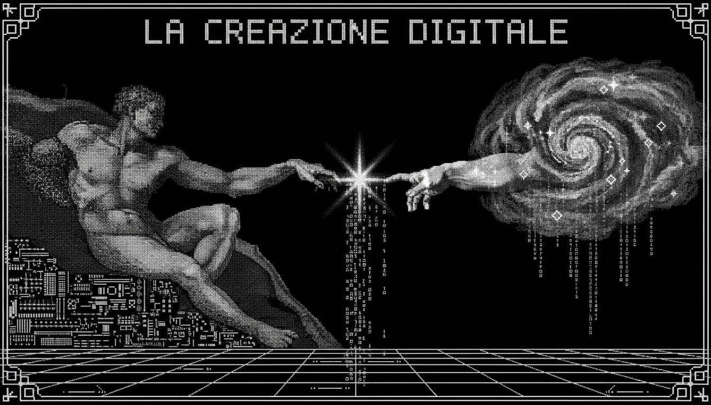

<!-- ═══════════════════════════════════════════════════════════════════════════════
     HERO: Retrowave Cathedral Landscape
     ═══════════════════════════════════════════════════════════════════════════════ -->

<!-- ═══════════════════════════════════════════════════════════════════════════════
     NAME: Perfect typing animation (no image text)
     ═══════════════════════════════════════════════════════════════════════════════ -->

<pre>
╔═══════════════════════════════════════════════════════════════════════════╗
║  XP  ████████████████████████████████████████░░░░  72%  LVL 24         ║
║  HP  ██████████████████████████████████████████  MAX                   ║
║  MP  ██████████████████████████████████████░░░░░  85%                 ║
║  CAF ██████████████████████████████████████████  ∞                    ║
╚═══════════════════════════════════════════════════════════════════════════╝
</pre>

<!-- ═══════════════════════════════════════════════════════════════════════════════
     SECTION: La Creazione — ASCII Art Masterpiece
     ═══════════════════════════════════════════════════════════════════════════════ -->

<pre>
╔═══════════════════════════════════════════════════════════════════════════╗
║                                                                           ║
║     "AND THE DIVINE SPARK OF CREATION REACHED THE ARCHITECT..."          ║
║                                                                           ║
║              [ DIVINE ]  ←── ✦ ──→  [ MORTAL ]                          ║
║              Cloud/AI         The Spark        Kevin Duran Bruno          ║
║                                                                           ║
╚═══════════════════════════════════════════════════════════════════════════╝
</pre>

<!-- ═══════════════════════════════════════════════════════════════════════════════
     SECTION: Vitruvian Globe — ASCII Animated World
     ═══════════════════════════════════════════════════════════════════════════════ -->

<pre style="line-height: 1;">
                      ████████████
                  ████▓▓▓▓▓▓▓▓▓▓▓▓████
                ███▓▓▓▓▓▓▓▓▓▓▓▓▓▓▓▓▓▓▓███
              ███▓▓▓▓▓▓▓▓▓▓▓▓▓▓▓▓▓▓▓▓▓▓▓███
            ███▓▓▓▓▓▓▓▓▓▓▓▓▓▓▓▓▓▓▓▓▓▓▓▓▓▓▓███
          ███▓▓▓▓▓▓▓▓▓▓▓▓▓▓▓▓▓▓▓▓▓▓▓▓▓▓▓▓▓▓███
         ███▓▓▓▓▓▓▓▓▓▓▓▓▓▓▓▓▓▓▓▓▓▓▓▓▓▓▓▓▓▓▓▓███
        ███▓▓▓▓▓▓▓▓▓▓▓▓▓▓▓▓▓▓▓▓▓▓▓▓▓▓▓▓▓▓▓▓▓▓███
       ███▓▓▓▓▓▓▓▓▓▓▓▓▓▓▓▓▓▓▓▓▓▓▓▓▓▓▓▓▓▓▓▓▓▓▓▓███
       ███▓▓▓▓▓▓▓▓▓▓▓▓▓▓▓▓▓▓▓▓▓▓▓▓▓▓▓▓▓▓▓▓▓▓▓▓███
       ███▓▓▓▓▓▓▓▓▓▓▓▓▓▓▓▓▓▓▓▓▓▓▓▓▓▓▓▓▓▓▓▓▓▓▓▓███
       ███▓▓▓▓▓▓▓▓▓▓▓▓▓▓▓▓▓▓▓▓▓▓▓▓▓▓▓▓▓▓▓▓▓▓▓▓███
        ███▓▓▓▓▓▓▓▓▓▓▓▓▓▓▓▓▓▓▓▓▓▓▓▓▓▓▓▓▓▓▓▓▓▓███
         ███▓▓▓▓▓▓▓▓▓▓▓▓▓▓▓▓▓▓▓▓▓▓▓▓▓▓▓▓▓▓▓▓███
          ███▓▓▓▓▓▓▓▓▓▓▓▓▓▓▓▓▓▓▓▓▓▓▓▓▓▓▓▓▓███
            ███▓▓▓▓▓▓▓▓▓▓▓▓▓▓▓▓▓▓▓▓▓▓▓▓▓███
              ███▓▓▓▓▓▓▓▓▓▓▓▓▓▓▓▓▓▓▓████
                ████▓▓▓▓▓▓▓▓▓▓▓▓████
                    ████████████
</pre>

<pre>
╔═══════════════════════════════════════════════════════════════════════════╗
║                                                                           ║
║  ☩ KEVIN DURAN BRUNO ☩                                                   ║
║  ┌─────────────────────────────────────────────────────────────────┐     ║
║  │  ORIGIN    │ Dominican Republic 🇩🇴                              │     ║
║  │  CLASS     │ Full-Stack Architect                               │     ║
║  │  ALIGNMENT │ Chaotic Builder                                    │     ║
║  │  FOCUS     │ Backend · Cloud · AI · Distributed Systems         │     ║
║  │  STATUS    │ Architecting digital cathedrals                    │     ║
║  └─────────────────────────────────────────────────────────────────┘     ║
║                                                                           ║
╚═══════════════════════════════════════════════════════════════════════════╝
</pre>

<!-- ═══════════════════════════════════════════════════════════════════════════════
     SECTION: Statue of David — Skill Matrix
     ═══════════════════════════════════════════════════════════════════════════════ -->

<pre>
╔══════════════════════════════════════════════════════════════════════════════════╗
║                                                                                  ║
║   SYSTEM ARCHITECTURE    ████████████████████████████████████░░░  95/100       ║
║   BACKEND ENGINEERING    █████████████████████████████████░░░░  92/100       ║
║   PROBLEM SOLVING        ████████████████████████████████████░  96/100       ║
║   DATABASE DESIGN        ████████████████████████████████░░░░  85/100       ║
║   CLOUD & DEVOPS         ███████████████████████████░░░░░░░░░  78/100       ║
║   FRONTEND CRAFT         ████████████████████████░░░░░░░░░░░░  72/100       ║
║   MOBILE DEVELOPMENT     ████████████████████████░░░░░░░░░░░░  70/100       ║
║                                                                                  ║
╠══════════════════════════════════════════════════════════════════════════════════╣
║   "Every block of stone has a statue inside it" — Michelangelo                   ║
║   "Every codebase has an architecture inside it" — Kevin Duran Bruno             ║
╚══════════════════════════════════════════════════════════════════════════════════╝
</pre>
<!-- ═══════════════════════════════════════════════════════════════════════════════
     SECTION: The Great Cathedral — Tech Arsenal
     ═══════════════════════════════════════════════════════════════════════════════ -->

<pre>
╔═══════════════════════════════════════════════════════════════════════════════════════════╗
║                                                                                           ║
║  ┌────────────────────────┐  ┌────────────────────────┐  ┌────────────────────────┐      ║
║  │   ⚔️ HIGH TONGUES     │  │   🛡️ DIVINE ARMOR     │  │   ☁️ AETHER INFRA     │      ║
║  ├────────────────────────┤  ├────────────────────────┤  ├────────────────────────┤      ║
║  │  C# / .NET             │  │  ASP.NET Core          │  │  Azure                 │      ║
║  │  Kotlin                │  │  Blazor                │  │  Google Cloud          │      ║
║  │  Go                    │  │  Jetpack Compose       │  │  Docker                │      ║
║  │  Python                │  │  React                 │  │  Kubernetes            │      ║
║  │  Java                  │  │  Tailwind CSS          │  │  Linux                 │      ║
║  │                        │  │                        │  │  Git / CI·CD           │      ║
║  └────────────────────────┘  └────────────────────────┘  └────────────────────────┘      ║
║                                                                                           ║
║  ┌────────────────────────┐  ┌──────────────────────────────────────────────────┐      ║
║  │   🗄️ RELICS OF DATA   │  │   📜 SCROLLS OF WISDOM                          │      ║
║  ├────────────────────────┤  ├──────────────────────────────────────────────────┤      ║
║  │  PostgreSQL            │  │  Distributed Systems Architecture                │      ║
║  │  MySQL                 │  │  Microservices Design Patterns                   │      ║
║  │  MongoDB               │  │  Cloud-Native Development                        │      ║
║  │  Redis                 │  │  Event-Driven Architecture                       │      ║
║  │  Entity Framework      │  │  API Design (REST · gRPC · GraphQL)             │      ║
║  │                        │  │  Test-Driven Development                         │      ║
║  └────────────────────────┘  └──────────────────────────────────────────────────┘      ║
║                                                                                           ║
╚═══════════════════════════════════════════════════════════════════════════════════════════╝
</pre>
<!-- ═══════════════════════════════════════════════════════════════════════════════
     SECTION: The Last Judgment — Quests
     ═══════════════════════════════════════════════════════════════════════════════ -->

<pre>
╔═══════════════════════════════════════════════════════════════════════════════════════════╗
║                                                                                           ║
║  ⚡ IN PROGRESS                                                                           ║
║  ─────────────────────────────────────────────────────────────────────────────────────  ║
║  ░▒▓█  Build scalable distributed systems                                               ║
║  ░▒▓█  Master cloud-native architecture patterns                                        ║
║  ░▒▓█  Explore AI & automation frontiers                                                ║
║  ░▒▓█  Contribute to open source (unlocking "Open Source Hero")                        ║
║  ░▒▓█  Deepen Go language mastery                                                       ║
║                                                                                           ║
╠═══════════════════════════════════════════════════════════════════════════════════════════╣
║                                                                                           ║
║  ✦ COMPLETED                                                                              ║
║  ─────────────────────────────────────────────────────────────────────────────────────  ║
║  ████  Backend systems with C# & .NET                                                   ║
║  ████  Android apps with Kotlin & Jetpack Compose                                      ║
║  ████  Cloud deployments on Azure & GCP                                                 ║
║  ████  CI/CD pipeline mastery                                                           ║
║  ████  Survived countless debugging wars ⚔                                              ║
║                                                                                           ║
╚═══════════════════════════════════════════════════════════════════════════════════════════╝
</pre>
<!-- ═══════════════════════════════════════════════════════════════════════════════
     SECTION: Collector's Hall — Achievements
     ═══════════════════════════════════════════════════════════════════════════════ -->

<pre>
╔═══════════════════════════════════════════════════════════════════════════╗
║                                                                           ║
║  🏆 Code Whisperer         ████████████████████████████████  UNLOCKED   ║
║  🏆 Cloud Walker           ████████████████████████████████  UNLOCKED   ║
║  🏆 The Architect          ████████████████████████████████  UNLOCKED   ║
║  🏆 Island Dev             ████████████████████████████████  UNLOCKED   ║
║                                                                           ║
║  🔓 Open Source Hero       ░░░░░░░░░░░░░░░░░░░░░░░░░░░░░░░░  PROGRESS   ║
║  🔓 1K Followers           ░░░░░░░░░░░░░░░░░░░░░░░░░░░░░░░░  PROGRESS   ║
║  🔓 Polyglot God           ░░░░░░░░░░░░░░░░░░░░░░░░░░░░░░░░  LOCKED     ║
║                                                                           ║
╚═══════════════════════════════════════════════════════════════════════════╝
</pre>

<!-- ═══════════════════════════════════════════════════════════════════════════════
     GITHUB STATS — Monochrome Theme
     ═══════════════════════════════════════════════════════════════════════════════ -->

<!-- ═══════════════════════════════════════════════════════════════════════════════
     ANIMATED SNAKE
     ═══════════════════════════════════════════════════════════════════════════════ -->

<picture>
  <source media="(prefers-color-scheme: dark)" srcset="https://raw.githubusercontent.com/platane/platane/output/github-contribution-grid-snake-dark.svg"/>
  <source media="(prefers-color-scheme: light)" srcset="https://raw.githubusercontent.com/platane/platane/output/github-contribution-grid-snake.svg"/>
  
</picture>

<!-- ═══════════════════════════════════════════════════════════════════════════════
     SPOTIFY
     ═══════════════════════════════════════════════════════════════════════════════ -->

https://open.spotify.com/user/31w6sfodg2c5tnbfuef3juaxkk2m

<!-- ═══════════════════════════════════════════════════════════════════════════════
     TROPHIES
     ═══════════════════════════════════════════════════════════════════════════════ -->

<!-- ═══════════════════════════════════════════════════════════════════════════════
     CONTACT — Communication Channels
     ═══════════════════════════════════════════════════════════════════════════════ -->

<pre>
───────────────────────────────────────────────────────────────────────────────
/ / / / / / / / / / / /  R E T R O W A V E   G R I D  / / / / / / / / / / / /
───────────────────────────────────────────────────────────────────────────────
</pre>

<!-- ═══════════════════════════════════════════════════════════════════════════════
     FOOTER
     ═══════════════════════════════════════════════════════════════════════════════ -->

<pre>
╔═══════════════════════════════════════════════════════════════════════════╗
║                                                                           ║
║              ⚡  INSERT COIN TO CONTINUE...  ⚡                           ║
║                                                                           ║
║         ☩ KEVIN DURAN BRUNO ☩  FULL-STACK ARCHITECT ☩                   ║
║                                                                           ║
║              Made with ❤️ from 🇩🇴 + ☕ + 🌙 + 💻                        ║
║                                                                           ║
╚═══════════════════════════════════════════════════════════════════════════╝
</pre>

